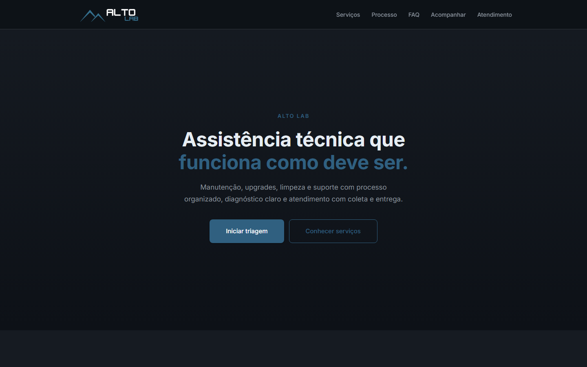
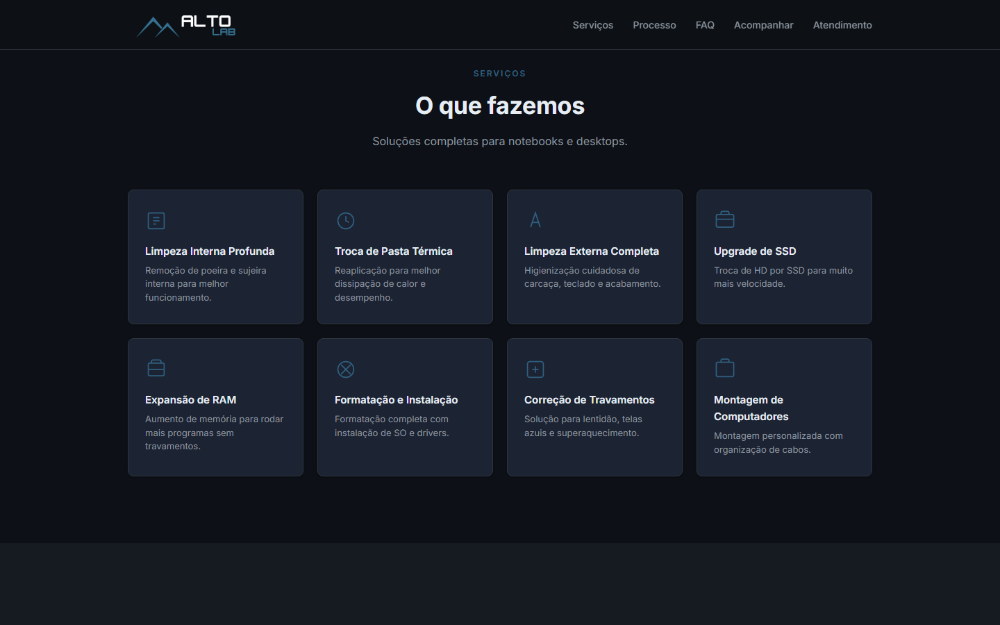
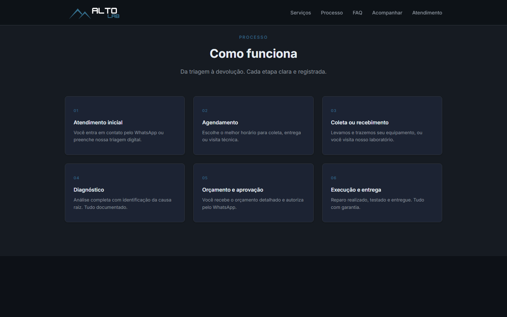
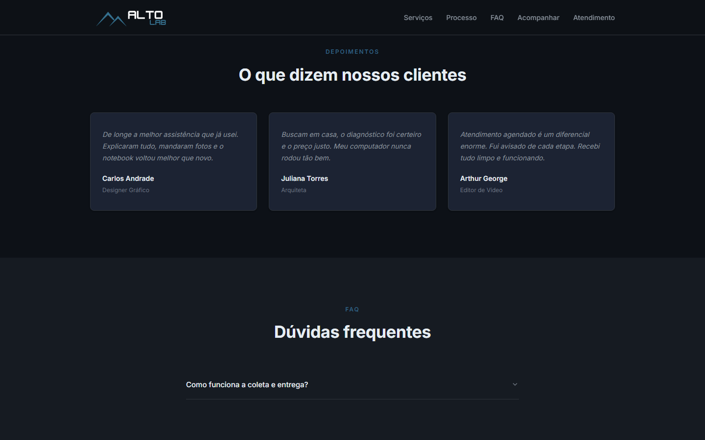
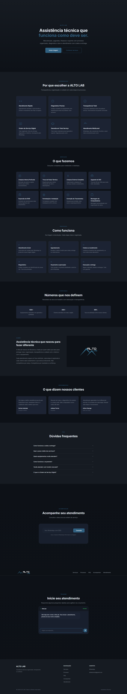
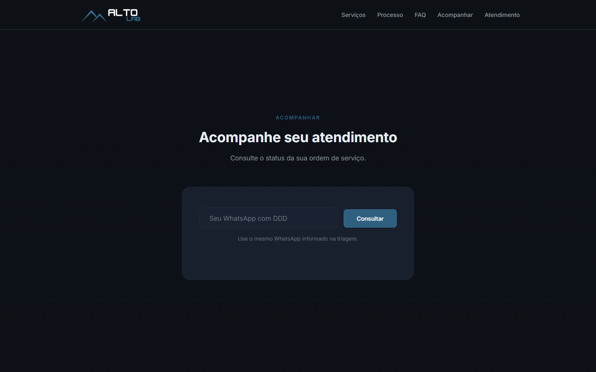
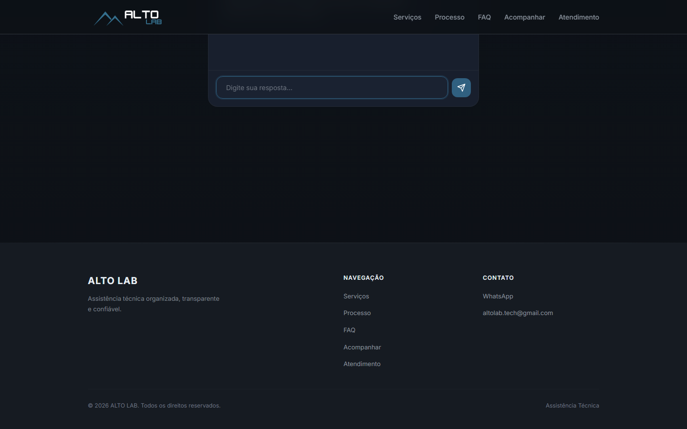

<div align="center">
  <br/>
  <h1>ALTOLAB OS</h1>
  <p><strong>Custom management system built exclusively for Alto Lab</strong><br/>
  <strong>Sistema de gestão personalizado desenvolvido exclusivamente para a Alto Lab</strong></p>
  <br/>
  <p>
    Made by / Feito por
    <a href="https://github.com/renato0x" target="_blank"><strong>@renato0x</strong></a>
  </p>
  <br/>
  <a href="#">
    
  </a>
  <a href="#">
    
  </a>
  <a href="#">
    
  </a>
  <a href="#">
    
  </a>
  <a href="#">
    
  </a>
  <a href="#">
    
  </a>
  <br/>
  <a href="#">
    
  </a>
  <a href="#">
    
  </a>
  <a href="#">
    
  </a>
  <br/><br/>
</div>

---

## Overview | Visão Geral

**EN** — ALtoLab OS is a custom-built management system developed exclusively for Alto Lab, a technical assistance business based in Montes Claros, MG. It consists of two integrated applications:

- **Management Panel** — Private administrative interface for internal daily operations (service orders, customers, finances, scheduling, reports)
- **Customer Portal** — Public-facing website with WhatsApp chat, order tracking, and company presentation

This is not a commercial product. It was designed and built to meet the specific operational needs of Alto Lab — no more, no less.

**PT-BR** — ALtoLab OS é um sistema de gestão feito sob medida exclusivamente para a Alto Lab, assistência técnica sediada em Montes Claros, MG. É composto por duas aplicações integradas:

- **Painel de Gestão** — Interface administrativa privada para operações internas diárias (ordens de serviço, clientes, finanças, agenda, relatórios)
- **Portal do Cliente** — Site público com chat WhatsApp, acompanhamento de serviços e apresentação da empresa

Não é um produto comercial. Foi projetado e construído para atender às necessidades operacionais específicas da Alto Lab — nem mais, nem menos.

---

## Screenshots

### Management Panel | Painel de Gestão

<div align="center">

| Dashboard | Orders Kanban |
|:---:|:---:|
|  |  |

| Customers | Financial Dashboard |
|:---:|:---:|
|  |  |

| Schedule | Reports |
|:---:|:---:|
|  |  |

</div>

### Customer Portal | Portal do Cliente

<div align="center">

| Hero | Services |
|:---:|:---:|
|  |  |

| Process | Testimonials |
|:---:|:---:|
|  |  |

| Chat Triage | Order Tracking |
|:---:|:---:|
|  |  |

| Footer |
|:---:|
|  |

</div>

---

## Features | Funcionalidades

### Service Order Management | Gestão de Ordens de Serviço

**EN**
- Full Kanban workflow: new intake, awaiting collection, received, diagnosis, awaiting approval, awaiting parts, in repair, testing, ready, delivered, closed
- Detail view with device info, budget items (parts + labor), payment tracking, and event history
- Smart status transitions with conditional dialogs (parts selection for "awaiting parts", diagnosis preview for "awaiting approval")
- Budget creation with JSONB parts items and labor amounts
- WhatsApp notification on every relevant status change
- CSV export

**PT-BR**
- Fluxo Kanban completo: novo atendimento, aguardando coleta, recebido, em diagnóstico, aguardando aprovação, aguardando peça, em reparo, em teste, pronto, entregue, encerrado
- Visão detalhada com informações do dispositivo, itens do orçamento (peças + mão de obra), histórico de pagamentos e eventos
- Transições inteligentes com diálogos condicionais (seleção de peças para "aguardando peça", preview do diagnóstico para "aguardando aprovação")
- Criação de orçamento com itens em JSONB e valores de mão de obra
- Notificação via WhatsApp a cada mudança relevante de status
- Exportação CSV

### Customer Management | Gestão de Clientes

**EN**
- Searchable registry with CPF/CNPJ, phone, address, and neighborhood
- Full service history per customer
- CSV export with UTF-8 BOM for Excel compatibility

**PT-BR**
- Cadastro pesquisável com CPF/CNPJ, telefone, endereço e bairro
- Histórico completo de serviços por cliente
- Exportação CSV com BOM UTF-8 para compatibilidade com Excel

### Financial Control | Controle Financeiro

**EN**
- Overview dashboard: total received, pending, overdue, monthly revenue
- Payment listing with filters by date range, method, and status
- Payment detail view with proof upload (images, PDF)
- Payment methods CRUD (PIX, cash, credit/debit card, bank transfer, boleto)
- PIX key and name configurable from the interface
- CSV export

**PT-BR**
- Dashboard financeiro: total recebido, pendente, vencido, faturamento mensal
- Listagem de pagamentos com filtros por período, método e status
- Detalhe do pagamento com upload de comprovante (imagens, PDF)
- CRUD de métodos de pagamento (PIX, dinheiro, cartão crédito/débito, transferência, boleto)
- Chave e nome PIX configuráveis pela interface
- Exportação CSV

### Schedule | Agenda

**EN**
- Calendar view with event management
- Event types: collection, delivery, technical visit, general appointment
- Linked to customers and service orders

**PT-BR**
- Visualização em calendário com gerenciamento de eventos
- Tipos de evento: coleta, entrega, visita técnica, agendamento
- Vinculado a clientes e ordens de serviço

### Reports | Relatórios

**EN**
- Daily and monthly revenue charts
- Service order status distribution
- Exportable data

**PT-BR**
- Gráficos de faturamento diário e mensal
- Distribuição por status de ordens de serviço
- Dados exportáveis

### WhatsApp Integration | Integração WhatsApp

**EN**
- Automatic messages for status changes, budget creation, and payment requests
- Diagnosis details and PIX information embedded in messages
- Direct links to customer WhatsApp chat

**PT-BR**
- Mensagens automáticas para mudanças de status, criação de orçamento e solicitações de pagamento
- Detalhes do diagnóstico e informações do PIX embutidos nas mensagens
- Links diretos para o WhatsApp do cliente

### Security | Segurança

**EN**
- Rate limiting: 30 requests/min general, 5 requests/min login
- Security headers: HSTS, X-Frame-Options, Content-Security-Policy
- Row-Level Security (RLS) on all Supabase tables
- Generic login error messages (no information leakage)
- Admin authentication via Supabase Auth

**PT-BR**
- Limitação de taxa: 30 requisições/min geral, 5 requisições/min login
- Headers de segurança: HSTS, X-Frame-Options, Content-Security-Policy
- Row-Level Security (RLS) em todas as tabelas do Supabase
- Mensagens de erro genéricas no login (sem vazamento de informação)
- Autenticação de admin via Supabase Auth

---

## Customer Portal | Portal do Cliente

**EN** — The public-facing site at **https://altolabtech.vercel.app** provides customers with:

- **Interactive Triage Chat** — Conversational interface that collects device information and issue description, sends data directly to the management system
- **Order Tracking** — Phone-based lookup showing service order status with color-coded badges and timeline
- **Services Showcase** — 8 service categories displayed in a clean card grid
- **Company Presentation** — About section, differentiators, testimonials, FAQ accordion
- **WhatsApp Integration** — Floating chat button and triage flow linked to Alto Lab's WhatsApp

**PT-BR** — O site público em **https://altolabtech.vercel.app** oferece aos clientes:

- **Chat de Triagem Interativo** — Interface conversacional que coleta informações do dispositivo e descrição do problema, enviando diretamente para o sistema de gestão
- **Acompanhamento de OS** — Consulta por telefone exibindo o status da ordem de serviço com badges coloridos e timeline
- **Vitrine de Serviços** — 8 categorias de serviços em grid de cards
- **Apresentação da Empresa** — Seção sobre, diferenciais, depoimentos, FAQ em acordeão
- **Integração WhatsApp** — Botão flutuante de chat e fluxo de triagem vinculado ao WhatsApp da Alto Lab

---

## Tech Stack | Tecnologias

| Layer / Camada | Technology / Tecnologia |
|---|---|
| **Frontend** | Next.js 15 (App Router), TypeScript, Tailwind CSS 4, Shadcn/ui, Lucide React |
| **Site** | Vanilla HTML + CSS + JavaScript (Inter, Google Fonts) |
| **Backend** | Next.js API Routes, Supabase Edge Functions |
| **Database** | Supabase (PostgreSQL) — Row-Level Security enabled |
| **Auth** | Supabase Auth |
| **Storage** | Supabase Storage (payment proofs, bucket with MIME validation) |
| **Hosting** | Vercel |
| **Testing** | Playwright (screenshots, E2E) |

---

## Project Structure | Estrutura do Projeto

```
OSLab/
  altolab-painel/              # Next.js 15 management panel
    ├── src/
    │   ├── app/               # App Router pages + API routes
    │   ├── components/        # Reusable UI components
    │   └── lib/               # Utilities, helpers, WhatsApp integration
    ├── supabase/migrations/   # Database migrations
    └── scripts/               # Admin and seed scripts
  altolab-site/                # Static customer-facing website
    ├── index.html             # Single-page site
    ├── style.css              # Styles
    └── script.js              # Interactive features (chat, tracking, FAQ)
```

---

## Deployments | Deploys

| Application / Aplicação | URL | Access / Acesso |
|---|---|---|
| **Customer Portal / Portal do Cliente** | [https://altolabtech.vercel.app](https://altolabtech.vercel.app) | Public / Público |
| **Management Panel / Painel de Gestão** | — | Private (not disclosed) / Privado (não divulgado) |

---

<div align="center">
  <br/>
  <p><strong>ALTOLAB OS</strong></p>
  <p>
    Built exclusively for <strong>Alto Lab</strong> · Montes Claros, MG · Made by <a href="https://github.com/renato0x"><strong>@renato0x</strong></a>
  </p>
  <p>
    Desenvolvido sob medida para a <strong>Alto Lab</strong> · Montes Claros, MG · Feito por <a href="https://github.com/renato0x"><strong>@renato0x</strong></a>
  </p>
  <br/>
</div>
