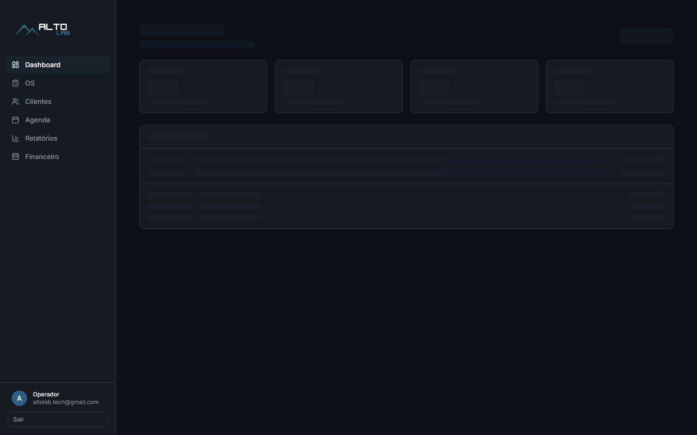
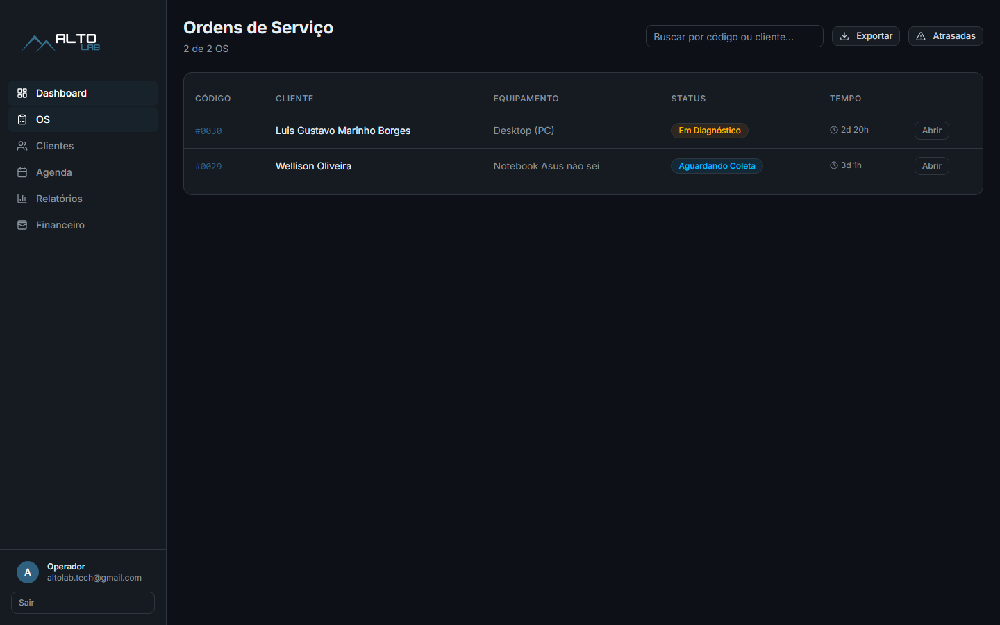
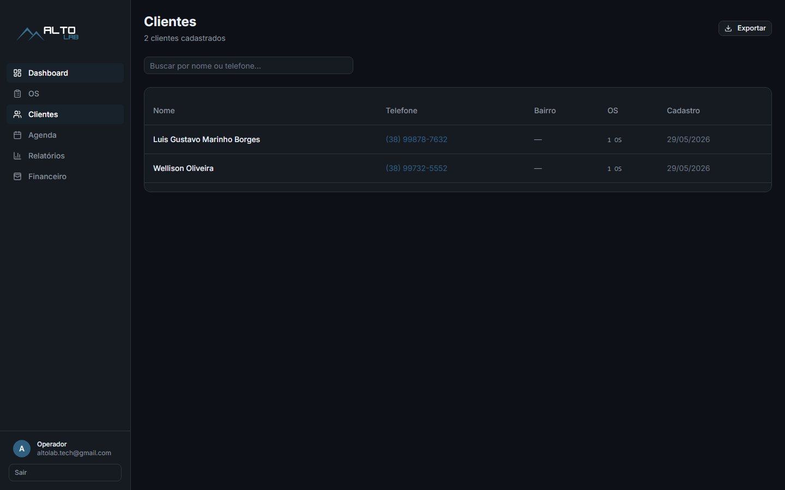
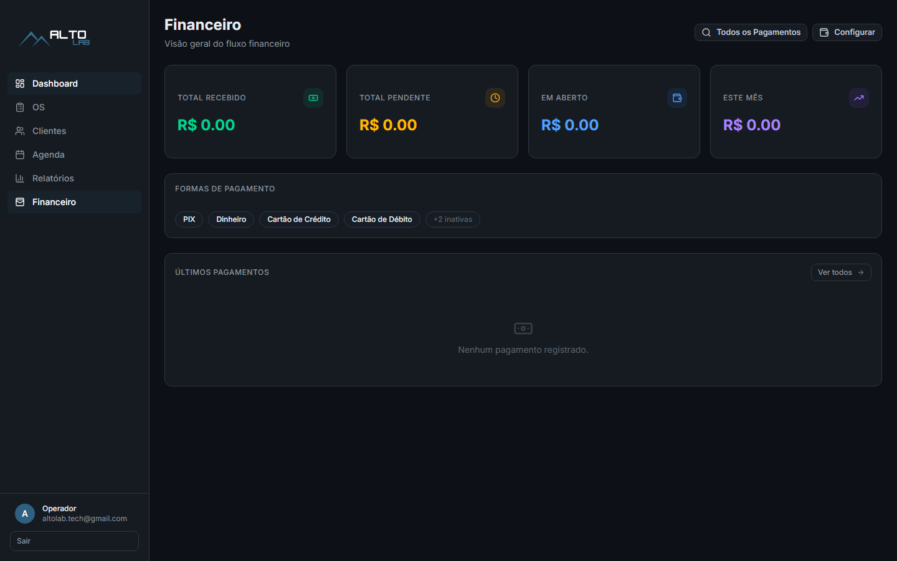
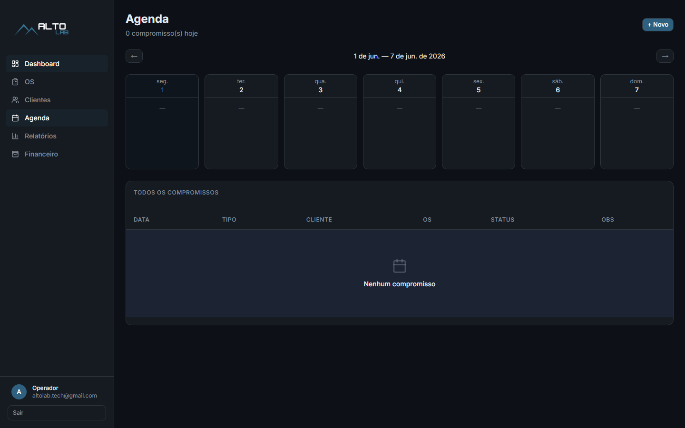
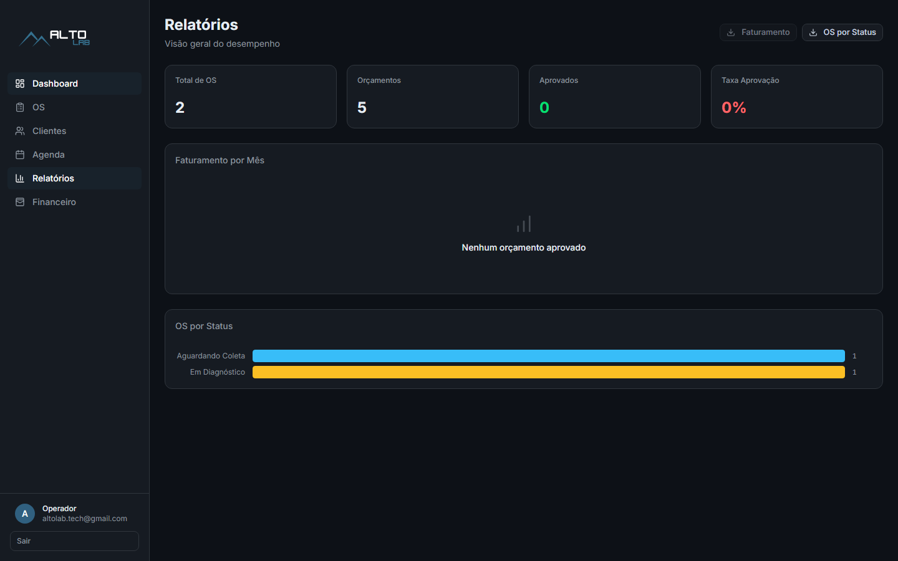

# altolab OS

Complete platform for managing service orders, customers, scheduling, and financial control — built for small repair shops and technical assistance businesses.

> **Live apps:**
> - [altolab-painel.vercel.app](https://altolab-painel.vercel.app) — Management panel
> - [altolabtech.vercel.app](https://altolabtech.vercel.app) — Customer-facing site

## Tech Stack

**Frontend** — Next.js 15 (App Router), TypeScript, Tailwind CSS 4, Shadcn/ui, Lucide React

**Backend** — Next.js API routes, Supabase (PostgreSQL + Auth + Storage), Rate limiting

**Infrastructure** — Vercel (deploy), GitHub (versioning)

## Features

### Service Order Management
- Kanban board with status workflow (new, diagnosed, budget sent, approved, in progress, awaiting parts, completed, delivered)
- Detail view with budget items, payment tracking, event history
- Status change dialog with conditional steps (parts selection for `awaiting_parts`, diagnosis for `awaiting_approval`)

### Customer Management (CRM)
- Customer registry with search and filtering
- Service history per customer
- CSV export

### Financial Dashboard
- Overview cards (total received, pending, overdue, monthly revenue)
- Payment listing with filters (date range, method, status)
- Payment detail view with proof upload
- Payment methods CRUD (PIX, cash, credit/debit card, transfer, boleto)
- PIX key/name configuration
- CSV export

### Schedule
- Calendar view with event creation and management
- Service order integration

### Reports
- Revenue charts (daily, monthly)
- Status distribution
- Exportable data

### WhatsApp Integration
- Automatic messages for status changes, budgets, payment requests
- Diagnosis and PIX key included in messages
- Direct customer communication via WhatsApp links

### Security
- Rate limiting (general: 30 req/min, login: 5 req/min)
- Security headers (HSTS, X-Frame-Options, CSP)
- Row-Level Security (RLS) on Supabase
- Generic login error messages
- Admin authentication via Supabase Auth

## Screenshots

| Dashboard | Orders Kanban |
|---|---|
|  |  |

| Customers | Financial Dashboard |
|---|---|
|  |  |

| Schedule | Reports |
|---|---|
|  |  |

## License

MIT
